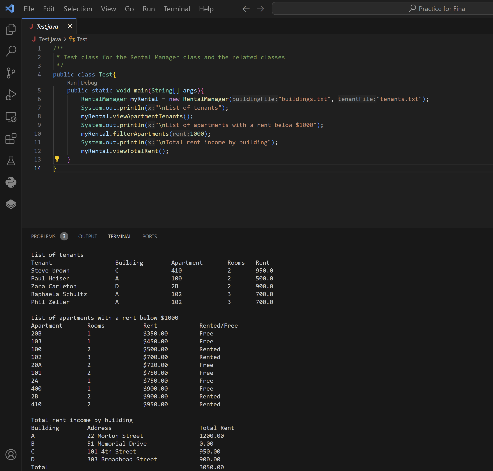

## About Me

I'm a senior at Lehigh University graduating with a finance major and computer science minor. I have interned most recently as a Private Equity Analyst at [Alchemy Capital Partners](https://www.alchemycappartners.com/), as a Data Analytics Intern at [OneMain Financial](https://www.onemainfinancial.com/), and as a Sales Intern at [Millennium Advisors](https://millenniumadvisors.com/). 

---

At Lehigh University I have enjoyed a breadth of finance courses in: [Data Science for Finance](https://ledatascifi.github.io/ledatascifi-2024/content/frontpage.html), Advanced Financial Modeling, Startup and Venture Capital Finance, Derivatives and Risk Management, Securities Analysis and Portfolio Management, Corporate Finance, and Investments. 

[Click for More Information](https://catalog.lehigh.edu/coursesprogramsandcurricula/businessandeconomics/finance/#courseinventory)

---

Courses in computer science: [Programming and Data Structures](https://engineering.lehigh.edu/cse/academics/course-index/cse-17-programming-and-data-structures-3), [Web Systems Programming](https://engineering.lehigh.edu/cse/academics/course-index/cse-264-web-systems-programming-3), [Introduction to Data Science](https://engineering.lehigh.edu/cse/academics/course-index/cse-160-introduction-data-science-3), Survey of Artificial Intelligence, Business Information Systems.

<!-- Upload your own photo and change the path -->

  

---

## Portfolio

---

_**[FIN 377: Data Science for Finance Final Project](https://github.com/ZiggyFloydLee/FIN377-FinalProject-Team12)**_

This is a link to the repo for my final project in FIN 377. In this project my group and I look into the IPO market, comparing traditional and SPAC IPOs.

---

_**[Java Project](/portfolio/Java.zip)**_

This is a link to download a zip file of a project I did in java.

---

_**[Personal Python Projects](https://github.com/ZiggyFloydLee/SportsAnalysisExploration)**_

This ia a repo with some of my personal projects around sports analysis.

---

_**[RStudio Project](/portfolio/R.zip)**_

## Career Objectives

Upon graduation from Lehigh University, I will be working at [SEI](https://www.seic.com/) as an Operations Analyst. My interests include: Sales & Trading, PE, VC, and Hedge Funds.

---

## Hobbies

My hobbies include playing and watching soccer, I play defensive midfield and center back. I am a Manchester United fan. I love to play games: poker, chess, sudoku, and video games.

---

Page template forked from <a href="https://github.com/evanca/quick-portfolio">evanca</a>

<!-- Remove above link if you don't want to attibute -->
